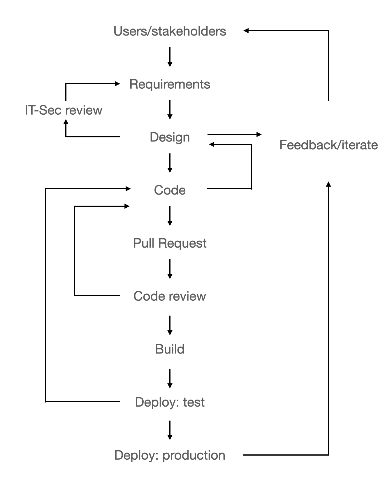

# Abstract

The ISO 27001 standard lists a host of requirements for implementing IT security in an organisation. Conforming to requirements of the standard can raise the cost and friction involved in releasing new services and features in an agile manner. This report will explore which tools and processes can be used to mitigate the potential clash between the goals of standard compliance, and sustaining an agile development culture. The report is organised as a case study at the University of Oslo's Center for IT, where the Services for Sensitive Data is in the process of adopting ISO 27001. _Keywords: Agile, SecDevOps, ISO 27001_

# Introduction

Agile software development (@agile_manifesto) is described as valuing:

* Individuals and interactions over processes and tools
* Working software over comprehensive documentation
* Customer collaboration over contract negotiation
* Responding to change over following a plan

So while the latter items are valuable, Agile sees the former items as _more valuable_. The University of Oslo's (UiO) Services for Sentitive Data (TSD), a special purpose eInfrastructure, is developed and operated by UiO's Center for IT's Section for Research Services. Agile software development is a well-established practice within the section, and is used to continuously develop new features and services for TSD.

At the same time the Section for Research Servics is working to certify TSD for ISO 27001 (@iso_27001). ISO 27001 stipulates that an organisation should adopt an Information Security Management System (ISMS) in order to manage risks, to ensure that its information security policies are met. The organistion shall identify, and analyse risks and their potential impact, and implement risk-mitigating controls. All of this needs to be documented, and updated over time. In practice this influences software development processes, and has the potential to uproot an agile development culture, by reversing the order of importance in the Agile values articulated above.

The rest of this report will explain how ISO 27001 certification can adversely affect TSD's agile development culture, and explore how SecDevOps can offer a solution to this conundrum.

# TSD - Services for Sensititve Data

TSD is a special purpose eInfrastructure designed for working with sensitive personal data. It is hosted at, and operated by the Section for Research Servces at the University of Oslo's Center for IT. In production since 2014, it is a remote-login platform-as-a-service solution supporting more than 1600 research projects, 8000 researchers, and 80 institutions. Development and operations is staffed by 14 full-time employees. TSD is working towards ceritifcation in ISO 9001 and ISO 27001 in 2023. As part of this process, software development processes must be reviewed to ensure compliance with the required controls.

# Agile software development at TSD

Figure 1 below illustrates how TSD practices agile software development.

{ width=50% }

The need for software development originates with the requirements of users and/or stakeholders. It is often necessary to reach agreement on what those requirements are before any software development happens. This is illustrated by the feedback-loop from requirements to design, and then back to the users and stakeholders. Once developers have a sufficiently clear understanding of the requirements, they decide to what extent the IT Security team needs to be involved. If the requirements translate into a new service, for example, then the design will be presented at the periodic change council. If any changes are needed, the design is updated, and implementation can begin.

While writing code, TSD developers run unit- and integration tests to ensure correctness. Once the feature that covers the requirements is implemented, a new patch is submitted for review by the core team, in the form of a pull request. Reviewers have the chance to comment on the proposed changes, and request additional changes if needed. This would lead to code being modified, and the pull request being updated. Once a reviewer approves of the changes, the changes are merged with the main codebase.

The new version is then built into an executable. The new version is first deployed to a test environment, where more integration tests are performed. If this uncovers any issues that were not caught by local testing during development, or during code review, then the necessary issues are fixed with a new pull request, reviewed, and deployed to test again, until all testing passes. Once deployed to production, users and/or stakehoders have the chance to give feedback. If needed, a new iterative cycle will begin.

TSD has been growing continually at a fast pace in the last five years, with more than one new research project signing up each work day. At the same, the complexity of user requirements increase, as more software and integrations are used in research. Taken together this means that the devlopment team gives high priority to speed in the implementation of new features. Fast release of new services and features is a key component to scaling the service with few employees, but of course this has to be accomplished without compromising the service's information security policies.

TSD has been able to apply agile software development and maintain its information security policies by building on top of a secure, and modular web development platform. At the same time TSD sees the need to pursue compliance with ISO 27001, as this will be an important strategic accomplishment, and will help with sustaining the effort for delivering secure IT services. The open question is how to achieve compliance without grinding the agile development process outlined above to a halt. The next section will explore the details of what compliance might mean for TSD's software development process.

# The impact of ISO 27001 on software development

This section reviews the controls listed in Annex A of the ISO 27001 which will have an impact on software development practices in TSD. For each control, the expected impact on TSD's software development process, with reference to Figure 1, is described.

## A.12.5.1 Installation of software on operational systems

_"Procedures shall be implemented to control the installation of software on operational systems."_

TSD lacks in this regard in the following ways:

* it does not have 100% coverage - there are updates which are not controlled
* where it does have control, there is too large variety in the mechanisms for updates

Getting 100% coverage, and sufficient standardisation has the potential to ease deployment, but it will require up-front investment in new tools and processes. Up until these tools and processes are in place, it will divert effort from releasing new end-user features. This poses a barrier to adoption and can be seen as standing in opposition to the agile principle of "Individuals and interactions over processes and tools". Successful introduction will, therefore, require a cultural change.

## A.12.6.1 Management of technical vulnerabilities

_"Information about technical vulnerabilities of information systems being used shall be obtained in a timely fashion, the organisation's exposure to such vulnerabilities evaluated and appropriate measures taken to address the associated risk."_

TSD uses open source software in its development, and as such are exposed to vulnerabilities in the entire supply chain associated with its open source dependencies. Open source software repositories have varying levels of sophistication in their ability to detect and report on vulnerabilities in their hosted packages. TSD will have to do research to see which tools exist, and how they can be incorporated into the development cycle. In practice this will raise the cost of including any new dependencies, and the hope is that tools exist that can mitigate the increase in this cost.

## A.14.1.1 Information security requirements analysis and specification

_"The information security related requirements shall be included in the requirements for new information systems or enhancements to existing information systems."_

TSD already involves the IT security team in the design and implementation phase of new services and signifcant new features. TSD also has a culture of considering the security implications of releasing new features. The additional effort required is to document that this has been done, and to do so _in each and every change_. This will add some documentation overhead to development.

## A.14.2.2 System change control procedures

_"Changes to systems within the development lifecycle shall be controlled by the use of formal control procedures."_

This is arguably similar to item A.12.5.1, but can be interpreted more broadly: that it applies to systems used _during_ development, in addition to those used in delivering actual IT services. In brief, it means more documentation overhead.

## A.14.2.4 Restrictions on changes to software packages

_"Modifications to software packages shall be discouraged, limited to necessary changes and all changes shall be strictly controlled."_

This will introduce more friction to dependency management, as each new dependency will have to be evaluated before adoption. As such it raises the cost of development.

## A.14.2.8 System security testing

_"Testing of security functionality shall be carried out during development."_

TSD already uses both unit- and integration-testing during development, but does not have full coverage on this. This will, therefore, be a change of degree as such testing is rolled out to all components, and as the coverage for any given component is increased. It does, however, increase the setup cost involved in establishing a development environment. If not implemented well, it could be a barrier to entry for new contributors.

## A.14.2.9 System acceptance testing

_"Acceptance testing programs and related criteria shall be established for new infomation systems, updgrades and new versions."_

TSD already has a test environment where integration tests are performed before production release, but as mentioned in the discussion of A.12.5.1, it lacks 100% system coverage. Achieving compliance with this control will require a more feature complete testing environment, more comprehensive test suites, and documentation. This could potentially raise the cost of release, slowing development.

## A.15.1.3 Information and communication technology supply chain

_"Agreements with suppliers shall include requirements to address the information security risks associated with information and communications technology services and product supply chains."_

As mentioned in the discussion of control A.12.6.1, TSD uses open source software in development. The licensing model of open source software gives the user no warranty at all. TSD must therefore, internalise any risk associated with using such software. The implication is that each explicit dependency must be included an a risk assessment. This raises the cost of development.

# Problem statement

Analysis of the ISO 27001 control measures that will impact software development show that TSD's current agile process will be impacted in the following ways:

1. Documentation: Policies, procedures
2. Dependency management: vulnerability detection, risk assessment
3. Testing: security testing during development, acceptance testing during release

In sum, this amounts to a cultural change, and to a potential increase in development effort and time needed to release new features. The next section will explore a developement and operational methodology called SecDevOps, to see how it can help offset the potential devlopment costs associated with ISO 27001 compliance.

# SecDevOps as a solution

# Concrete suggestions

# References
